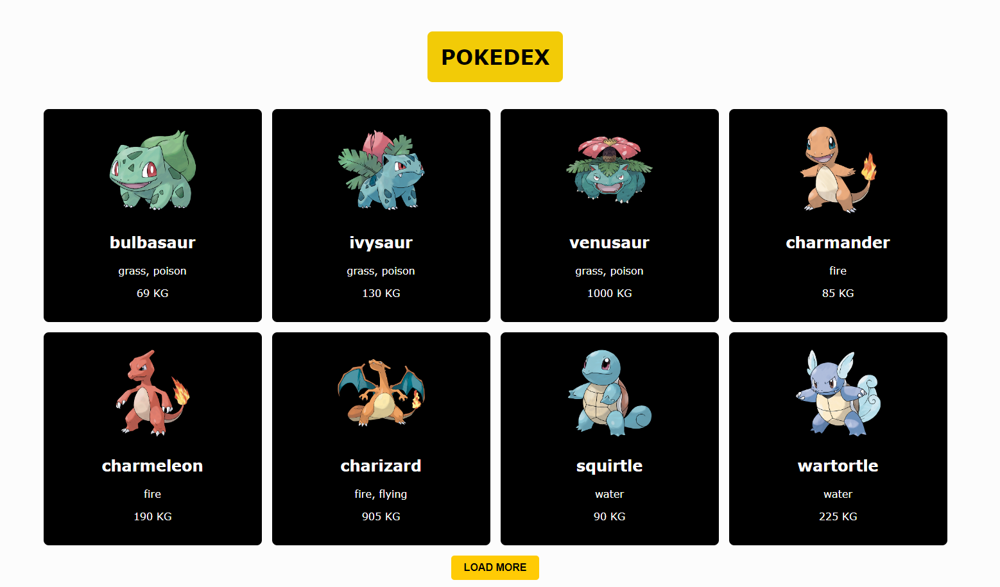

# Lista de Pokémon
Esta página web es un simple listado de Pokémon. Puedes cargar una lista inicial de Pokémon y luego cargar más Pokémon haciendo clic en el botón "Load More".

## Tutorial
Para ejecutar la página web en tu entorno local, sigue estos pasos:

1. Clona este repositorio a tu máquina local.
2. Abre una terminal y navega hasta la carpeta del proyecto.
3. Ejecuta el siguiente comando para instalar las dependencias necesarias:
   -`npm i`
4. Después de instalar las dependencias, ejecuta el siguiente comando para iniciar el servidor de desarrollo:
   -`npm run dev`
5. Abre tu navegador web y visita `http://localhost:5173` para ver la página web en acción.

¡Eso es todo! Ahora puedes explorar la lista de Pokémon y cargar más si lo deseas.

